# 📸 Backup & Snapshot System - Hayai

## 🎯 Overview

Hayai provides a **comprehensive backup system** designed for developers who need reliable data protection across multiple database types. The system offers **two complementary approaches**: individual database snapshots for quick backups and complete environment backups for full data protection.

## 🔧 Two Backup Systems

### **1. 📸 Individual Snapshots** - `hayai snapshot`
**Purpose**: Quick backup of specific databases during development

### **2. 🏢 Complete Environment Backup** - Script-based
**Purpose**: Full environment backup including all databases, logs, and metadata

---

## 📸 Individual Snapshots System

### **Basic Usage**

```bash
# Create a snapshot of a specific database
hayai snapshot <database-name>

# Create compressed snapshot with custom output
hayai snapshot mydb --compress --output ./my-backups

# List all available snapshots
hayai snapshot list

# Create snapshot in specific format
hayai snapshot mydb --format tar --compress
```

### **Supported Database Engines & Formats**

| Database Engine | Default Format | Backup Method | Output Extension |
|----------------|----------------|---------------|------------------|
| **PostgreSQL** | SQL | `pg_dump` | `.sql` |
| **MariaDB** | SQL | `mysqldump` | `.sql` |
| **Redis** | RDB | `BGSAVE` | `.rdb` |
| **SQLite** | Database File | Direct Copy | `.db` |
| **DuckDB** | Database File | Direct Copy | `.db` |
| **InfluxDB 2.x/3** | Compressed | `tar` Archive | `.tar.gz` |
| **All Others** | Generic | `tar` Archive | `.tar.gz` |

### **Command Options**

```bash
hayai snapshot <name> [options]

Options:
  -o, --output <path>      Output directory for snapshot (default: ./snapshots)
  -c, --compress           Compress the snapshot
  --format <format>        Snapshot format: sql, rdb, tar (default: sql)
  -h, --help              Show help
```

### **Snapshot Process Flow**

```mermaid
graph TD
    A[hayai snapshot mydb] --> B{Database Running?}
    B -->|No| C[❌ Error: Database must be running]
    B -->|Yes| D[Detect Database Engine]
    D --> E{Engine Type}
    E -->|PostgreSQL| F[pg_dump → .sql]
    E -->|Redis| G[BGSAVE → .rdb]
    E -->|SQLite| H[Copy file → .db]
    E -->|Others| I[tar archive → .tar.gz]
    F --> J[Save to snapshots/]
    G --> J
    H --> J
    I --> J
    J --> K[✅ Snapshot Created]
```



### **Directory Structure**

```
project/
├── snapshots/                                    # Snapshot directory
│   ├── mydb-snapshot-2025-01-08T10-30-45Z.sql   # PostgreSQL snapshot
│   ├── cache-snapshot-2025-01-08T10-31-12Z.rdb  # Redis snapshot
│   ├── data-snapshot-2025-01-08T10-32-01Z.db    # SQLite snapshot
│   └── influx-snapshot-2025-01-08T10-33-15Z.tar.gz # InfluxDB snapshot
```

### **Practical Examples**

#### **Development Workflow**
```bash
# 1. Create snapshot before risky operations
hayai snapshot production-db

# 2. Perform development/testing
# ... make changes ...

# 3. If something goes wrong, restore from snapshot
# (manual restoration process)

# 4. Create final snapshot after successful changes
hayai snapshot production-db --compress
```

#### **Database-Specific Examples**

**PostgreSQL**:
```bash
# Create SQL dump
hayai snapshot user-db
# → snapshots/user-db-snapshot-2025-01-08T10-30-45Z.sql

# Restore manually:
docker exec -i hayai-user-db-1 psql -U admin -d database < snapshots/user-db-snapshot-2025-01-08T10-30-45Z.sql
```

**Redis**:
```bash
# Create RDB backup
hayai snapshot session-cache
# → snapshots/session-cache-snapshot-2025-01-08T10-31-12Z.rdb

# Restore manually:
docker cp snapshots/session-cache-snapshot-2025-01-08T10-31-12Z.rdb hayai-session-cache-1:/data/dump.rdb
docker restart hayai-session-cache-1
```

---

## 🏢 Complete Environment Backup System

### **Script-Based Backup**

The environment backup system uses the `scripts/db-lifecycle.sh` script to create comprehensive backups of the entire Hayai environment.

```bash
# Create complete environment backup
./scripts/db-lifecycle.sh backup

# Restore from specific backup
./scripts/db-lifecycle.sh restore backups/20250108_103045

# List available backups
ls -la backups/
```

### **What's Included in Environment Backup**

- ✅ **All Database Dumps**: PostgreSQL, MariaDB with full schema and data
- ✅ **Redis Data**: RDB snapshots with all keys and values
- ✅ **Database-Specific Data**: Users, products, and other table-specific exports
- ✅ **System Logs**: Application and database logs
- ✅ **Metadata**: Backup information, timestamps, container details
- ✅ **Configuration State**: Current database configurations

### **Environment Backup Structure**

```
backups/20250108_103045/
├── backup_info.txt              # 📋 Backup metadata
├── users_backup.sql             # 🐘 Full PostgreSQL dump
├── users_data.sql               # 👥 Users table data only
├── products_data.sql            # 📦 Products table data only
├── redis_backup.rdb             # 🔴 Redis RDB snapshot
└── logs_backup/                 # 📝 System logs
    ├── postgresql.log
    ├── redis.log
    └── hayai.log
```

### **Backup Metadata Example**

```txt
# backup_info.txt
Backup criado em: Mon Jan  8 10:30:45 -03 2025
Diretório: backups/20250108_103045
Versão Docker Compose: 2.34.0-desktop.1
Containers incluídos: cache-redis-db demo-postgres-db main-postgres-db users-db-db
Total de bancos: 4
```

### **Environment Backup Process**

```bash
# Step-by-step process
backup_data() {
    # 1. Create timestamped directory
    BACKUP_DIR="backups/$(date +%Y%m%d_%H%M%S)"
    mkdir -p "$BACKUP_DIR"
    
    # 2. Backup PostgreSQL databases
    docker-compose exec -T users-db-db pg_dump -U admin -d database > "$BACKUP_DIR/users_backup.sql"
    docker-compose exec -T users-db-db pg_dump -U admin -d database --data-only --table=users > "$BACKUP_DIR/users_data.sql"
    
    # 3. Backup Redis
    docker-compose exec -T cache-redis-db redis-cli BGSAVE
    docker cp "$(docker-compose ps -q cache-redis-db):/data/dump.rdb" "$BACKUP_DIR/redis_backup.rdb"
    
    # 4. Backup logs
    cp -r logs "$BACKUP_DIR/logs_backup"
    
    # 5. Create metadata file
    echo "Backup criado em: $(date)" > "$BACKUP_DIR/backup_info.txt"
}
```

### **Restoration Process**

```bash
# Restore complete environment
./scripts/db-lifecycle.sh restore backups/20250108_103045

# Manual restoration steps:
# 1. Stop current databases
docker-compose stop

# 2. Restore PostgreSQL
docker-compose exec -T users-db-db psql -U admin -d database < backups/20250108_103045/users_backup.sql

# 3. Restore Redis
docker cp backups/20250108_103045/redis_backup.rdb "$(docker-compose ps -q cache-redis-db):/data/dump.rdb"
docker-compose restart cache-redis-db

# 4. Restart all services
docker-compose start
```

---

## 🛠️ Configuration-Based Backup (.hayaidb)

### **Volume Mapping for Persistent Backups**

Configure automatic backup directories in your `.hayaidb` file:

```yaml
version: "1.0"
project: my-app
databases:
  main-postgres:
    engine: postgresql
    port: 5432
    environment:
      POSTGRES_DB: myapp
      POSTGRES_USER: admin
      POSTGRES_PASSWORD: password
      # Backup-specific configuration
      POSTGRES_ARCHIVE_MODE: "on"          # Enable WAL archiving
      POSTGRES_WAL_LEVEL: "replica"        # Enable replication logs
    volumes:
      - "postgres-data:/var/lib/postgresql/data"
      - "./backups/postgres:/backups"      # 📂 Backup volume
      - "./archives/postgres:/archives"    # 📂 WAL archive volume
    memory: "512m"
    restart: "unless-stopped"

  redis-cache:
    engine: redis
    port: 6379
    environment:
      REDIS_PASSWORD: password
      REDIS_AOF_ENABLED: "yes"              # Enable AOF persistence
      REDIS_RDB_ENABLED: "yes"              # Enable RDB snapshots
      REDIS_SAVE: "900 1 300 10 60 10000"   # RDB save schedule
    volumes:
      - "redis-data:/data"
      - "./backups/redis:/backups"          # 📂 Backup volume
    memory: "256m"
    restart: "unless-stopped"
```

### **Enterprise Backup Configuration**

```yaml
# Enterprise-level backup configuration
global:
  # Backup configuration
  backup:
    enabled: true                    # ✅ Enable automated backups
    schedule: "0 2 * * *"           # 🕐 Daily at 2 AM
    retention: "30d"                # 📅 Keep backups for 30 days
    compression: "gzip"             # 📦 Use gzip compression
    encryption: true                # 🔒 Encrypt backup files

  # Security configuration
  security:
    enable_ssl: true                # 🔐 SSL/TLS encryption
    ssl_cert_path: "./ssl"          # 📜 SSL certificates path
    enable_secrets: true            # 🔑 Enable secrets management
    secrets_backend: "vault"        # 🏦 Use HashiCorp Vault
```

---

## 📋 Best Practices

### **Development Environment**

```bash
# 1. Quick snapshot before risky operations
hayai snapshot mydb

# 2. Create development backup routine
#!/bin/bash
# dev-backup.sh
for db in $(hayai list --format json | jq -r '.[].name'); do
    hayai snapshot "$db" --compress
done
```

### **Production Environment**

```bash
# 1. Complete environment backup
./scripts/db-lifecycle.sh backup

# 2. Automated backup script
#!/bin/bash
# production-backup.sh
BACKUP_DIR="/secure/backups/$(date +%Y%m%d_%H%M%S)"
mkdir -p "$BACKUP_DIR"

# Full environment backup
./scripts/db-lifecycle.sh backup

# Copy to secure location
cp -r backups/latest/* "$BACKUP_DIR/"

# Clean old backups (keep last 7 days)
find /secure/backups -type d -mtime +7 -exec rm -rf {} \;
```

### **Backup Strategy Recommendations**

#### **🔄 Frequency Guidelines**

| Environment | Frequency | Method | Retention |
|-------------|-----------|--------|-----------|
| **Development** | Before major changes | `hayai snapshot` | 3-7 days |
| **Staging** | Daily | Environment backup | 14 days |
| **Production** | Daily + hourly snapshots | Both methods | 30+ days |

#### **📦 Storage Strategy**

```bash
# Local development
snapshots/                    # Quick snapshots
backups/                     # Environment backups

# Production
/var/backups/hayai/
├── daily/                   # Daily full backups
├── hourly/                  # Hourly snapshots
└── archived/               # Long-term storage
```

### **Automation Examples**

#### **Cron Job Setup**

```bash
# Add to crontab: crontab -e

# Daily full backup at 2 AM
0 2 * * * cd /path/to/hayai && ./scripts/db-lifecycle.sh backup

# Hourly snapshots during business hours
0 9-17 * * 1-5 cd /path/to/hayai && hayai snapshot production-db --compress

# Weekly cleanup
0 3 * * 0 find /path/to/hayai/snapshots -name "*.sql" -mtime +7 -delete
```

#### **Backup Health Check**

```bash
#!/bin/bash
# backup-health-check.sh

# Check if recent backups exist
LATEST_BACKUP=$(find backups/ -name "backup_info.txt" -mtime -1 | head -1)
if [ -z "$LATEST_BACKUP" ]; then
    echo "❌ No recent backup found!"
    exit 1
fi

# Check backup integrity
BACKUP_DIR=$(dirname "$LATEST_BACKUP")
if [ ! -f "$BACKUP_DIR/users_backup.sql" ]; then
    echo "❌ Incomplete backup: missing users_backup.sql"
    exit 1
fi

echo "✅ Backup health check passed"
```

---

## 🚨 Troubleshooting

### **Common Issues**

#### **Issue**: Snapshot fails with "Database not running"
```bash
# Solution: Start the database first
hayai start mydb
hayai snapshot mydb
```

#### **Issue**: Permission denied during backup
```bash
# Check Docker permissions
docker-compose exec users-db-db whoami
docker-compose exec users-db-db ls -la /tmp

# Fix permissions
docker-compose exec users-db-db chown postgres:postgres /tmp
```

#### **Issue**: Snapshot directory doesn't exist
```bash
# Create directory manually
mkdir -p snapshots
chmod 755 snapshots

# Or let Hayai create it
hayai snapshot mydb  # Will create directory automatically
```

#### **Issue**: Large database timeout
```bash
# Increase timeout for large databases
hayai snapshot large-db --format tar --compress
# TAR format is more efficient for large datasets
```

### **Backup Verification**

```bash
# Verify PostgreSQL backup
psql -U admin -d test_restore < snapshots/mydb-snapshot-latest.sql

# Verify Redis backup
redis-cli --rdb snapshots/cache-snapshot-latest.rdb

# Check backup file integrity
file snapshots/*.sql    # Should show "ASCII text"
file snapshots/*.rdb    # Should show "Redis RDB"
```

---

## 🔗 Related Commands

### **Complete Command Reference**

```bash
# Snapshot commands
hayai snapshot <name>                    # Create snapshot
hayai snapshot <name> --compress         # Create compressed snapshot
hayai snapshot <name> --format tar       # Create TAR archive
hayai snapshot <name> -o /custom/path    # Custom output directory
hayai snapshot list                      # List all snapshots
hayai snapshot list -d /custom/snapshots # List from custom directory

# Environment backup commands
./scripts/db-lifecycle.sh backup         # Create environment backup
./scripts/db-lifecycle.sh restore <dir>  # Restore environment backup
./scripts/db-lifecycle.sh status         # Show backup status

# Configuration commands
hayai init --config .hayaidb             # Initialize with backup config
hayai validate --config .hayaidb         # Validate backup configuration
```

### **Integration with Other Hayai Commands**

```bash
# Backup before operations
hayai snapshot mydb && hayai remove mydb   # Backup before removal
hayai snapshot mydb && hayai init -n mydb-new -e postgresql  # Backup before migration

# Backup all running databases
hayai list --running | xargs -I {} hayai snapshot {}
```

---

## 💡 Tips & Tricks

### **Development Workflow Tips**

```bash
# Create alias for quick backup
alias hbackup='hayai snapshot'
alias hrestore='echo "Manual restore required - check ABOUT_BACKUP.md"'

# Quick backup all
alias hbackup-all='for db in $(hayai list --format json | jq -r ".[].name"); do hayai snapshot "$db"; done'
```

### **Monitoring Backup Size**

```bash
# Check snapshot sizes
du -sh snapshots/*
find snapshots -name "*.sql" -exec du -sh {} \; | sort -hr

# Monitor backup growth
watch -n 60 'du -sh snapshots/ backups/'
```

### **Backup Compression Comparison**

| Format | Size | Speed | Compatibility |
|--------|------|-------|--------------|
| **SQL** | Large | Fast | ✅ Standard |
| **SQL + gzip** | Small | Medium | ✅ Universal |
| **TAR** | Medium | Medium | ✅ Archive |
| **TAR + gzip** | Small | Slow | ✅ Compressed |

---

## 📚 See Also

- **[README.md](README.md)** - Main project documentation
- **[HAYAIDB.md](HAYAIDB.md)** - Configuration file documentation
- **[CONTRIBUTING.md](CONTRIBUTING.md)** - How to contribute
- **[DEVELOPMENT.md](DEVELOPMENT.md)** - Development setup

---

**📸 Backup is not just a feature - it's your safety net for confident development!**

*Making database management 速い (hayai) since 2025* 