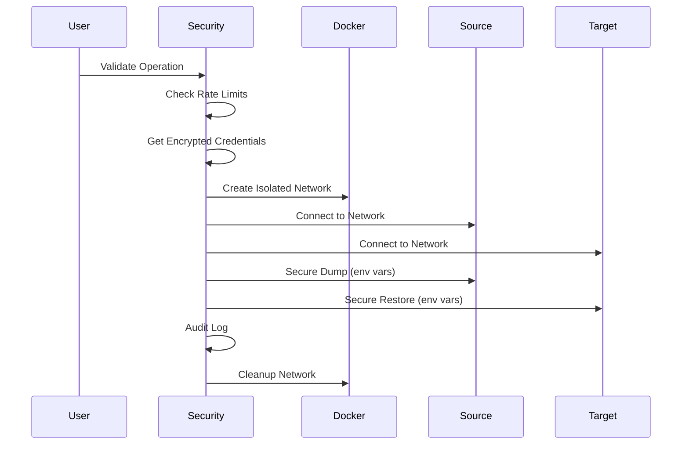
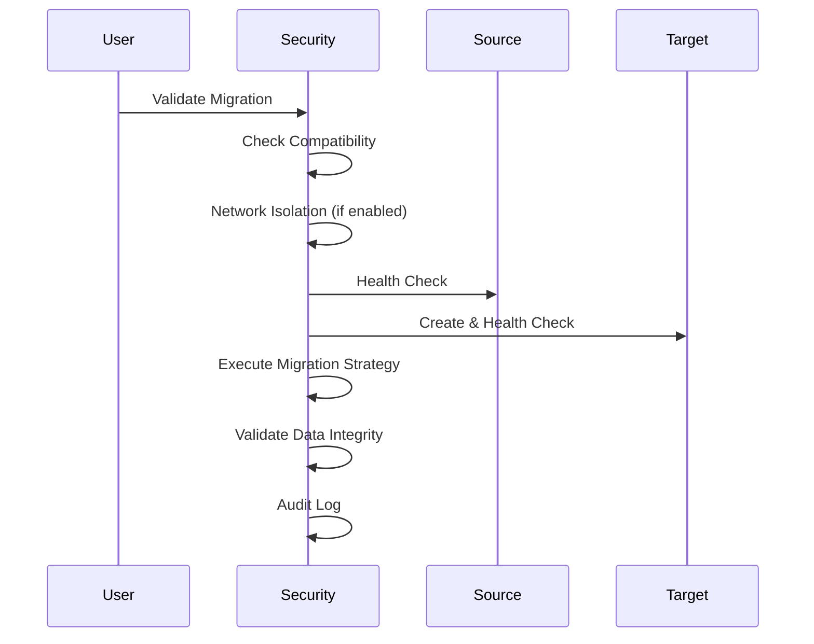

# 🔒 Hayai Security Guide

This documentation covers the security implemented in Hayai for database operations, including `clone`, `merge`, and `migrate`.

## 🚨 **Identified Vulnerability Analysis**

### **❌ Previous Security Issues**

#### **1. Hard-coded Credentials**
```typescript
// ⚠️ PROBLEM: Static passwords in code
POSTGRES_PASSWORD: 'password',
MYSQL_PASSWORD: 'password', 
REDIS_PASSWORD: 'password'
```

#### **2. Credential Exposure in Commands**
```bash
# ⚠️ PROBLEM: Passwords visible in shell history
pg_dump -U postgres  # Password may appear in logs
mysqldump -u root    # Credentials exposed
redis-cli -a password # Password visible in processes
```

#### **3. Lack of Network Isolation**
- Containers could communicate freely
- No network segmentation between databases
- Unnecessary service exposure

#### **4. No Access Control**
- Any user could clone/migrate any database
- No permission validation
- No operation tracking

## ✅ **Implemented Security Solutions**

### **🔐 1. Secure Credential Management**

#### **AES-256-CBC Encryption**
```typescript
// ✅ SOLUTION: Encrypted credentials
private encrypt(text: string): string {
  const iv = crypto.randomBytes(16);
  const cipher = crypto.createCipheriv('aes-256-cbc', Buffer.from(this.encryptionKey, 'hex'), iv);
  let encrypted = cipher.update(text, 'utf8', 'hex');
  encrypted += cipher.final('hex');
  return iv.toString('hex') + ':' + encrypted;
}
```

#### **Secure Password Generation**
```typescript
// ✅ SOLUTION: Random passwords of 16+ characters
public generateSecurePassword(length: number = 16): string {
  const charset = 'ABCDEFGHIJKLMNOPQRSTUVWXYZabcdefghijklmnopqrstuvwxyz0123456789!@#$%^&*';
  // Secure implementation with crypto.randomInt()
}
```

#### **Secure Storage**
- **Location**: `.hayai/credentials.enc`
- **Permissions**: `0o600` (only owner can read)
- **Encryption Key**: `.hayai/.key` (unique per installation)

### **🔒 2. Network Isolation**

#### **Isolated Docker Networks**
```typescript
// ✅ SOLUTION: Create isolated network for operations
public async createNetworkIsolation(instances: string[]): Promise<string> {
  const networkName = `hayai-op-${crypto.randomUUID().substring(0, 8)}`;
  
  const createNetwork = spawn('docker', [
    'network', 'create',
    '--driver', 'bridge',
    '--internal', // Isolates from external networks
    '--opt', 'com.docker.network.bridge.enable_icc=true',
    networkName
  ]);
}
```

#### **Isolation Benefits**
- Communication only between containers involved in operation
- No external access during sensitive operations
- Automatic cleanup after completion

### **📋 3. Audit and Logging**

#### **Structured Logging**
```typescript
// ✅ SOLUTION: Complete audit trail
export interface AuditLog {
  timestamp: string;
  operation: string;
  source: string;
  target: string;
  user: string;
  success: boolean;
  error?: string;
  ipAddress?: string;
}
```

#### **All Operations Recorded**
- **Location**: `.hayai/audit.log`
- **Format**: Structured JSON
- **Content**: Timestamp, operation, source, target, success/error

### **⚡ 4. Rate Limiting and Access Control**

#### **Configurable Security Policy**
```typescript
// ✅ SOLUTION: Customizable policies
export interface SecurityPolicy {
  requireAuthentication: boolean;
  allowCrossEngineOperations: boolean;
  enableNetworkIsolation: boolean;
  auditOperations: boolean;
  maxOperationsPerHour: number;
  allowedOperations: string[];
}
```

#### **Operation Validation**
```typescript
// ✅ SOLUTION: Granular control
public async validateOperation(
  operation: string, 
  sourceInstance: string, 
  targetInstance?: string,
  user: string = 'local'
): Promise<{ allowed: boolean; reason?: string }>
```

### **🛡️ 5. Secure Command Execution**

#### **Protected Environment Variables**
```typescript
// ✅ SOLUTION: Credentials via environment, not arguments
private async runSecureCommand(command: string[], credentials: SecurityCredentials): Promise<string> {
  const env = {
    ...process.env,
    PGPASSWORD: credentials.password,  // PostgreSQL
    MYSQL_PWD: credentials.password,   // MySQL/MariaDB
    REDIS_PASSWORD: credentials.password // Redis
  };
}
```

#### **No Command Line Exposure**
- Passwords never appear in `ps` or system logs
- Shell history doesn't contain credentials
- Processes don't expose sensitive information

## 🎯 **Security Command**

### **Initial Configuration**
```bash
# Configure security policies
hayai security --init
```

### **Credential Management**
```bash
# Generate secure password
hayai security --generate

# Manage instance credentials
hayai security --credentials

# View current policy
hayai security --policy
```

### **Auditing**
```bash
# View audit logs
hayai security --audit

# Security status
hayai security
```

## 📊 **Security Levels**

### **🟢 Maximum Security (Score: 90-100)**
```yaml
# .hayai/security.json
{
  "requireAuthentication": true,
  "allowCrossEngineOperations": false,
  "enableNetworkIsolation": true,
  "auditOperations": true,
  "maxOperationsPerHour": 10,
  "allowedOperations": ["clone", "backup"]
}
```

### **🟡 Balanced Security (Score: 60-80)**
```yaml
# Recommended default for development
{
  "requireAuthentication": false,
  "allowCrossEngineOperations": true,
  "enableNetworkIsolation": false,
  "auditOperations": true,
  "maxOperationsPerHour": 50,
  "allowedOperations": ["clone", "merge", "migrate", "backup", "restore"]
}
```

### **🔴 Minimum Security (Score: 20-40)**
```yaml
# Only for isolated environments
{
  "requireAuthentication": false,
  "allowCrossEngineOperations": true,
  "enableNetworkIsolation": false,
  "auditOperations": false,
  "maxOperationsPerHour": 999,
  "allowedOperations": ["*"]
}
```

## 🔄 **Security Flow in Operations**

### **Secure Clone**


### **Secure Migrate**


## 🚨 **Security Alerts**

### **Critical Files**
```bash
# 🔴 CRITICAL: Keep secure
.hayai/.key              # Encryption key
.hayai/credentials.enc   # Encrypted credentials

# 🟡 IMPORTANT: Regular backup
.hayai/security.json     # Security policies
.hayai/audit.log         # Audit logs
```

### **Recommended Permissions**
```bash
# Set restrictive permissions
chmod 600 .hayai/.key
chmod 600 .hayai/credentials.enc
chmod 644 .hayai/security.json
chmod 644 .hayai/audit.log
```

## 🛠️ **Best Practices**

### **For Local Development**
1. ✅ Enable audit logging
2. ✅ Use auto-generated passwords
3. ✅ Moderate rate limiting (50 ops/hour)
4. ⚠️ Network isolation optional

### **For Production Environments**
1. ✅ Enable all security features
2. ✅ Mandatory network isolation
3. ✅ Strict rate limiting (10-20 ops/hour)
4. ✅ Monitor audit logs
5. ✅ Regular backup of `.hayai` directory

### **For Teams**
1. ✅ Standardized security policy
2. ✅ Regular credential rotation
3. ✅ Periodic audit log review
4. ✅ Training on secure practices

## 🔍 **Integrity Validation**

### **Automatic Verification**
```typescript
// Post-operation validation
public async validateDataIntegrity(instanceName: string, engine: string): Promise<boolean>
```

### **Implemented Checks**
- **PostgreSQL**: Table verification and connectivity
- **Redis**: Responsiveness testing
- **MariaDB**: Data structure validation
- **Others**: Basic connectivity checks

## 📈 **Continuous Monitoring**

### **Security Metrics**
- Number of operations per hour/day
- Success/failure rate
- Most common operation types
- Blocked operation attempts

### **Recommended Alerts**
- Failure rate > 20%
- Frequent blocked operations
- Encrypted credential access
- Security policy modifications

## ⚠️ **Known Limitations**

### **Development Environment**
- Focus on local security, not multi-user
- File-based credentials, not HSM
- Network isolation may affect performance

### **Future Improvements**
- [ ] HSM/Vault integration
- [ ] Multi-factor authentication
- [ ] RBAC (Role-Based Access Control)
- [ ] LDAP/Active Directory integration
- [ ] Digital operation signing

---

## 🆘 **Support and Incidents**

### **In Case of Compromise**
1. **Stop all operations**: `hayai stop`
2. **Regenerate keys**: Remove `.hayai/.key` and reinitialize
3. **Rotate credentials**: `hayai security --credentials`
4. **Review logs**: `hayai security --audit`
5. **Reconfigure policy**: `hayai security --init`

### **Report Vulnerabilities**
- **GitHub Issues**: [Security Issues](https://github.com/hitoshyamamoto/hayai/issues)
- **Email**: andrehitoshi.01@gmail.com
- **Severity**: Classify with `security` label

---

**This security implementation transforms Hayai from a basic tool into an enterprise-ready solution for secure database management.** 